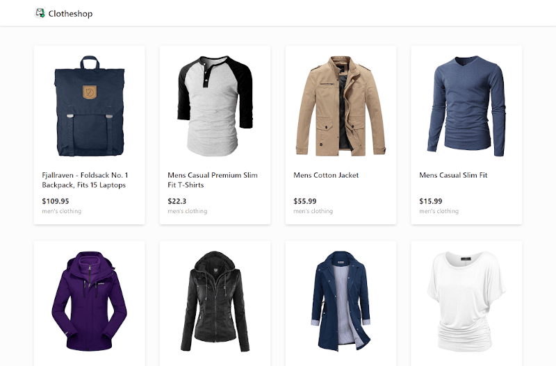

# Clotheshop

Online clothing store



## Built with

- [React](https://reactjs.org/)
- [Redux](https://react-redux.js.org/)
- [styled-components](https://styled-components.com/)
- [Vite](https://vitejs.dev/)

## Running the project

Install dependencies and run the project in development mode:

```bash
cd clotheshop
npm install # or yarn
npm run dev
```

This will start the development server on [localhost:3000](http://localhost:3000)
